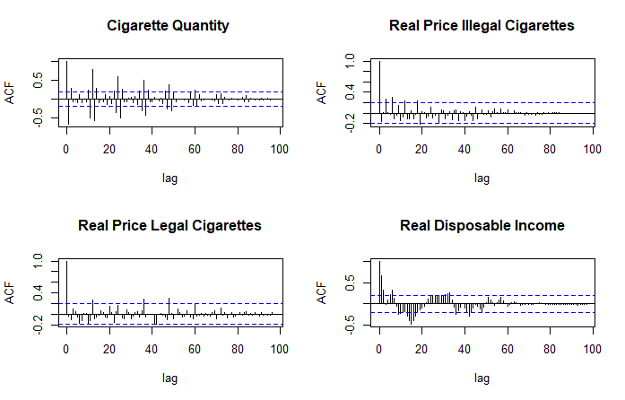

```{r setup, include=FALSE}
knitr::opts_chunk$set(echo = TRUE)
```

The purpose of this document is to track the process of writing and coding for this thesis.

# Structure of folder
* Save all data in the 'data' folder
* All functions are stored in the 'code' folder
* All text files are stored in the 'Tex' folder 

### Step 1: Data cleaning
Create a function to read in multiple excel sheets

```{r, echo=FALSE, include=FALSE, results='hide', eval=FALSE}
library("readxl")
source("code/sheets_df.R")
excel_1<- "C:/Users/Cassandra/OneDrive/Documents/2021 Academics/Thesis/Thesis/data/Copy of Item Sales, Pricing - Anelisa worked.xlsx"
sheets_df(excel_1)
filePath <- as.character("C:/Users/Cassandra/OneDrive/Documents/2021 Academics/Thesis/Thesis/data/Data.xlsx")
data <- read_excel(filePath)

```

# Table of acronyms

```{r codes, results = 'asis', echo=FALSE, warning =  FALSE, message=FALSE, fig.align = 'center', fig.cap = "Time Series Plot \\label{tab}", fig.ext = 'png', fig.height = 5, fig.width = 6}

library(xtable)
Acronym <- c('MPPC', 'WAP', 'DP', "DNP")
Meaning <- c('Most Popular Price Category', 'Weighted Average Price', "Duty Paid", 'Duty Not Paid')
#Shorthand <- c('QDP','PREALWAPDP','PREALWAPDNP', 'YDISPREAL')
#Meaning <- c('Quantity Duties Paid', 'Real Price Weighted Average ', '')

code <- data.frame(Acronym, Meaning)

data <- code %>% tibble::as_tibble()

table <- xtable(data, caption = "Shorthand Codes \\label{tab1}")
  print.xtable(table,
             # tabular.environment = "longtable",
             floating = TRUE,
             table.placement = 'H',
             # scalebox = 0.3,
             comment = FALSE,
             caption.placement = 'bottom',
             include.rownames = FALSE
             )

```


# Plot time series

```{r Figure1, echo=FALSE, warning =  FALSE, message=FALSE, fig.align = 'center', fig.cap = "Time Series Plot \\label{plot1}", fig.ext = 'png', fig.height = 5, fig.width = 6}
source("code/plot_ts.R")
ts <- plot_ts(log_data)
```

```{r}
# xl_data <- "C:/Users/Cassandra/OneDrive/Documents/2021 Academics/Thesis/Thesis/data/Copy of Item Sales, Pricing - Anelisa worked.xlsx"
excel_sheets(path=excel_2) #list the sheets in the excel data
# tab_names<- excel_sheets(path=xl_data) # assigning the sheet names to tab_names
# list_all<- lapply(tab_names, function(x) read_excel(path=xl_data, sheet = x))
# # str(list_all)
# source("code/Example_Plot_Scatter.R") 
# library(tidyverse)
# library(dplyr)
# 
# a<- xl_data  %>% excel_sheets() %>% set_names() %>% map(read_excel, path= xl_data) 
# list2env(a, envir=.GlobalEnv)
# 
# #Load a function from your 'code' folder. This e.g. plots scatters to your own preferences.
```


```{r acf_diff, echo=FALSE, warning =  FALSE, message=FALSE, fig.align = 'center', fig.cap = "Differenced Autocorrelation Functions \\label{acfdiff}", out.width="90%"}

```
