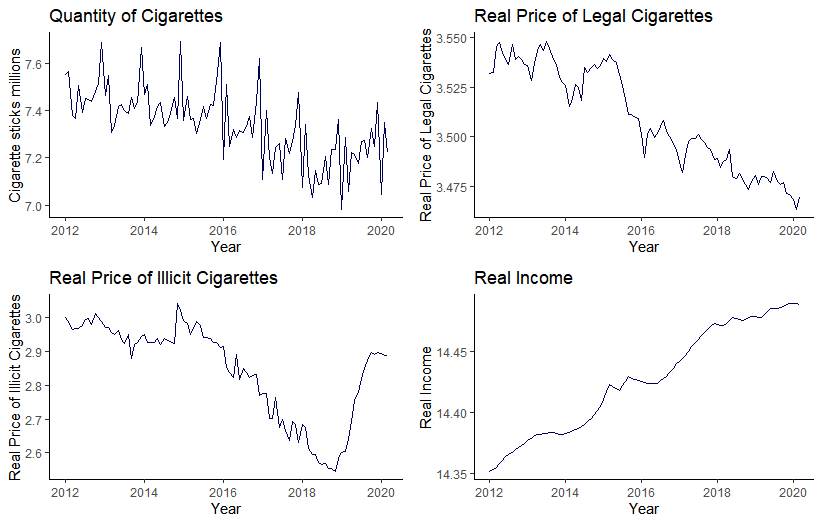
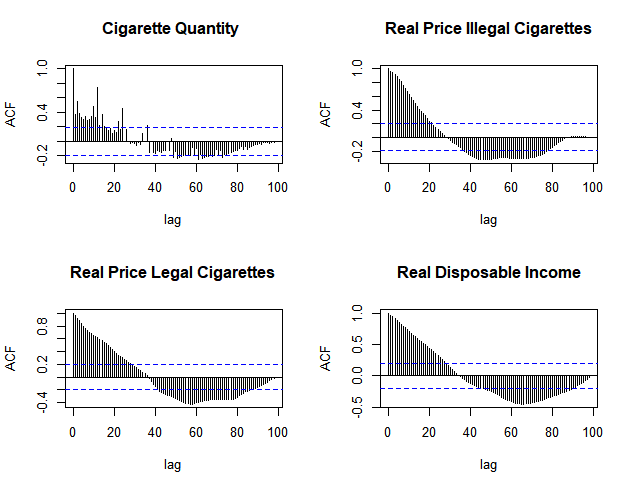

<!-- First: Set your default preferences for chunk options: -->

<!-- If you want a chunk's code to be printed, set echo = TRUE. message = FALSE stops R printing ugly package loading details in your final paper too. I also suggest setting warning = FALSE and checking for warnings in R, else you might find ugly warnings in your paper. -->

<!-- ############################## -->
<!-- # Start Writing here: -->
<!-- ############################## -->

The main aim of the study is to investigate the relationship between the legal and illegal tobacco market in South Africa. The study intends to:

* Define the legal and illegal tobacco market

* Model tobacco demand

* Estimate price elasticities

* Understand whether the illegal tobacco market constrains the legal market

According to @FATF[p. 7], the definition of illicit trading of tobacco products is: “…the supply, distribution and sale of smuggled genuine, counterfeit, or cheap white tobacco products…” where smuggling is conducted to avoid excise taxes, and/or to evade rules prohibiting the sale of such goods. As @Saenz acknowledge, one of the difficulties in investigating and modelling tobacco is deciding how to measure illicit trade, given the limits on the availability of data. These authors suggest that researchers studying illicit trade should cross-validate their estimates using different methods. 

This paper will measure the illicit market by two different methods. The first method defines the illicit market by price: if a pack of cigarettes is sold for less than the sum of the excise duty and VAT, then it follows that it has been sold illegally. The logic being that there is no economic incentive to sell packs at a loss, which suggests that if a pack is being sold at less than its tax amount, tax is not being paid on the cigarettes and they are thus illegal. The second method defines the illicit market by volume: the illegal market is the difference between the tax that should be paid on the total cigarette packs produced and sold, and the actual tax paid.

Following a similar approach as @Bos[p.9], a vector autoregression will be used to estimate the long run elasticities of cigarette consumption. The proposed base model is described by \ref{eq1}  

\begin{align}
 Q_t = \mu + \sum_{i = 1}^{n}\beta_iQ_{t-i} +\sum_{i = 1}^{n}\gamma_iP_{t-i} + \sum_{i = 1}^{n}\theta_iY_{t-i} + \sum_{i = 1}^{n}\phi_iI_{t-i} \label{eq1}
\end{align}

where $Q_t$ is the log of cigarette consumption,\newline
$P_{t}$ is the log of real cigarette price,\newline
$Y_{t}$ is the log of real disposable income,\newline
$I_{t}$ is the log of real illicit cigarette price,\newline
$n$ is the number of lags and t is measured in months

# Data \label{dat}

The sample period for this study runs from January 2012 to March 2020. Monthly data is used such that there are 99 observation points for each variable in the data set. One of the advantages of using monthly data rather than annual data is that it allows for more degrees of freedom. The data used includes figures for the prices and volumes of cigarettes in South Africa, tobacco excise duties, VAT, and disposable income. To prepare the data for analysis the most popular price category (MPPC) was identified as the 20-cigarette pack. Then a weighted average of before-tax 20-pack prices was used as a base price. The excise duty per 20's pack and VAT and were then added to the base price to calculate the price of licit cigarettes. The licit, illicit and disposable income amounts were adjusted for inflation, taking December 2016 as the base month and year. All of the variables have been transformed into log form. 

<!-- {width=100%, height=100%}\label{plot} -->

The figure below \ref{plot1} plots the time series of the logged variables. The graphs show that the data could be trending, which is formally tested in section \ref{Meth}.

\begin{figure}

{\centering \includegraphics{Thesis_Draft_files/figure-latex/Figure2-1} 

}

\caption{Time Series Plot \label{plot1}}\label{fig:Figure2}
\end{figure}

# Methodology \label{Meth}

To check whether the data is stationary, a number of tests is employed. First the autocorrelation functions are plotted below \ref{plot2}. They indicate that all four series are persistent; this is confirmed by the Ljung-Box tests in table \ref{box}. The Ljung-Box test for independence assesses whether there is significant evidence for non-zero correlations at a given lag, with the null hypothesis that there is independence in a given time series. A low p-value indicates a signal of non-stationarity.

 

\begin{table}[H]
\centering
\begin{tabular}{lrll}
  \hline
Time Series & p value & Test Result & Interpretation \\ 
  \hline
Cigarette Quantity & 0.00 & Reject Null & Non-stationary \\ 
  Real Price Legal & 0.00 & Reject Null & Non-stationary \\ 
  Real Price Illegal & 0.00 & Reject Null & Non-stationary \\ 
  Real Disposable Income & 0.00 & Reject Null & Non-stationary \\ 
   \hline
\end{tabular}
\caption{Ljung-Box Test \label{box}} 
\end{table}
The augmented Dickey Fuller test suggests that all four of the series contain a unit root (using the number of lags as 10^[Some of the series test as stationary when the number of lags is reduced]. This further suggests that the series are non-stationary. 

\begin{table}[H]
\centering
\begin{tabular}{lrll}
  \hline
Time Series & p value & Test Result & Interpretation \\ 
  \hline
Cigarette Quantity & 0.61 & Fail to reject Null & Non-stationary \\ 
  Real Price Legal & 0.22 & Fail to reject Null & Non-stationary \\ 
  Real Price Illegal & 0.38 & Fail to reject Null & Non-stationary \\ 
  Real Disposable Income & 0.06 & Fail to reject Null & Non-stationary \\ 
   \hline
\end{tabular}
\caption{Augmented Dickey-Fuller Test \label{adf}} 
\end{table}

To assess whether a long-run relationship between the variables exists, the Johansen test is employed. According to Akaike's information criterion (AIC), the appropriate maximum number of lags to use is 10 (\ref{lag}). A lag order of 9 is used for the test, since the test requires a lag order of N - 1 = 10 - 1 = 9. Two Johansen tests are used: the Trace and the Maximum Eigenvalue tests. The Trace statistic test (\ref{coint}) shows we reject the null hypothesis that there are zero cointegrating relationships: the test statistic 85.85 is greater than the 1% significance level of 55.43. The test results indicate that there is 1 cointegrating relationship. Similarly, the Maximum Eigenvalue test rejects that there are zero cointegrating relationships, and fails to reject that there is at most 1 cointegrating relationship. These results

The results, presented in Appendix 4, show
that there is one cointegrating vector among the variables. This signi…es the
existence of a long-run relationship among the variables that can be combined
with the short-run dynamics using a Vector Error Correction Model.21;30

\begin{table}[H]
\centering
\begin{tabular}{rrrr}
  \hline
AIC(n) & HQ(n) & SC(n) & FPE(n) \\ 
  \hline
 10 &   5 &   2 &  10 \\ 
   \hline
\end{tabular}
\caption{Optimal Lag Selection \label{lag}} 
\end{table}

\begin{table}[H]
\centering
\begin{tabular}{rrrrr}
  \hline
 & Test Statistic & 10\% & 5\% & 1\% \\ 
  \hline
r$<$=3 & 1.21 & 6.50 & 8.18 & 11.65 \\ 
  r$<$=2 & 6.04 & 15.66 & 17.95 & 23.52 \\ 
  r$<$=1 & 26.89 & 28.71 & 31.52 & 37.22 \\ 
  r=0 & 85.85 & 45.23 & 48.28 & 55.43 \\ 
   \hline
\end{tabular}
\caption{Johansen Trace Test for Cointegration Results\label{coint}} 
\end{table}
\begin{table}[H]
\centering
\begin{tabular}{rrrrr}
  \hline
 & Test Statistic & 10\% & 5\% & 1\% \\ 
  \hline
r$<$=3 & 1.21 & 6.50 & 8.18 & 11.65 \\ 
  r$<$=2 & 4.83 & 12.91 & 14.90 & 19.19 \\ 
  r$<$=1 & 20.85 & 18.90 & 21.07 & 25.75 \\ 
  r=0 & 58.95 & 24.78 & 27.14 & 32.14 \\ 
   \hline
\end{tabular}
\caption{Johansen Eigenvalue Test for Cointegration Results\label{eigen}} 
\end{table}

\newpage

# References {-}

